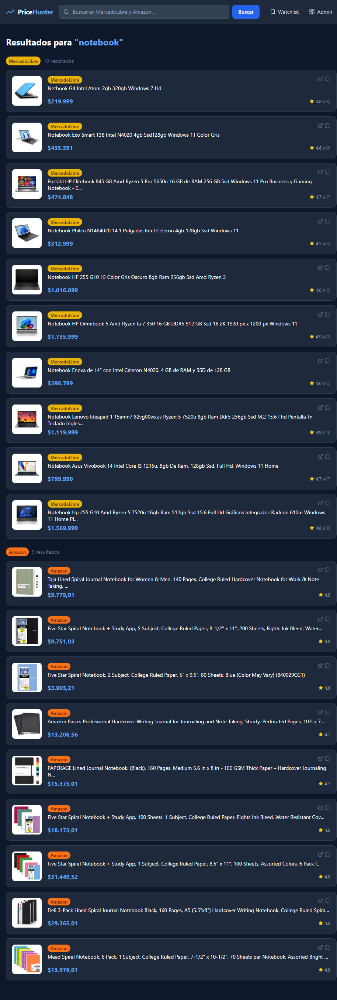
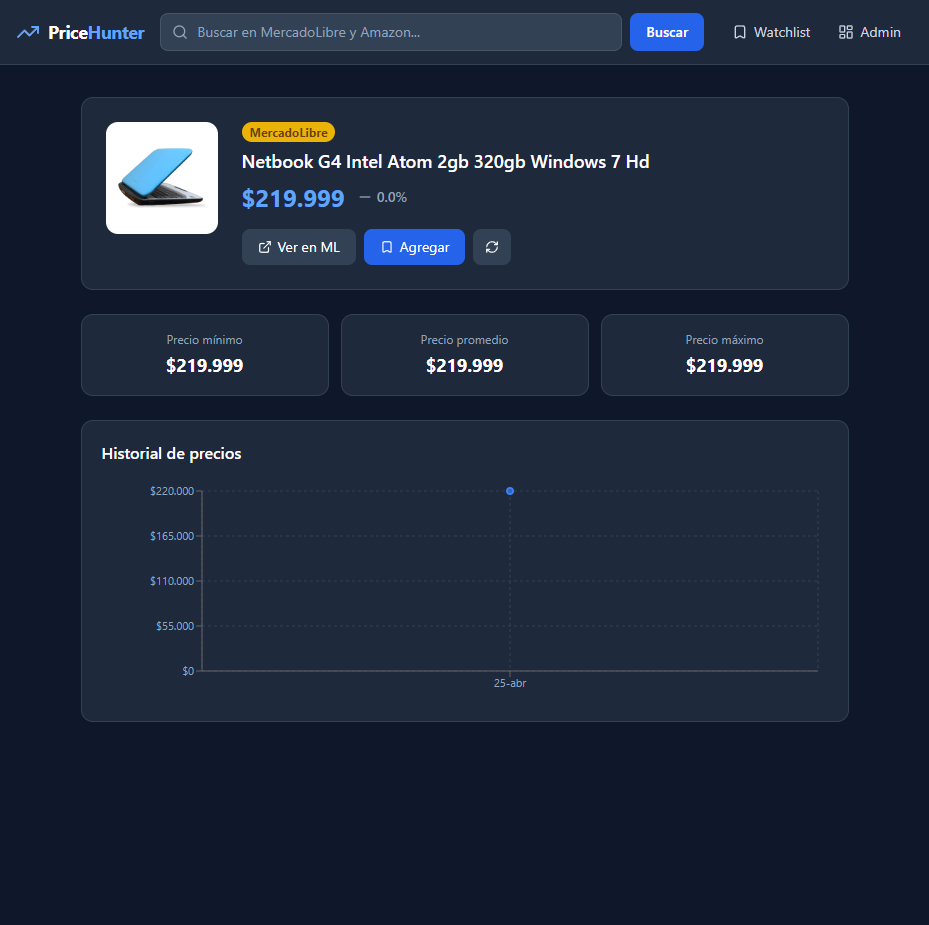
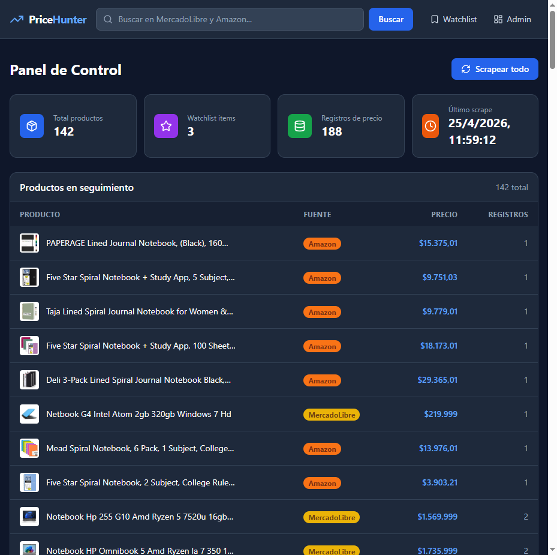

# PriceHunter 🔍

Comparador y tracker de precios multi-plataforma. Busca productos en **MercadoLibre Argentina** y **Amazon** simultáneamente, guarda historial de precios y permite armar una watchlist personal.

**Demo en vivo:** [pricehunter-pied.vercel.app](https://pricehunter-pied.vercel.app)

---

## Screenshots

### Home — Categorías y buscador


### Resultados — MercadoLibre vs Amazon lado a lado


### Detalle de producto — Historial de precios con gráfico


### Watchlist — Seguimiento con variación de precio


### Admin panel — Control y estadísticas


---

## Stack

| Capa | Tecnología |
|---|---|
| Backend | FastAPI + Python 3.11 |
| ORM | SQLAlchemy 2.0 (async) |
| Validación | Pydantic v2 |
| Base de datos | PostgreSQL (Render) |
| Scraping | httpx + BeautifulSoup4 + Playwright |
| Scheduler | APScheduler (cada 6h) |
| Frontend | React 18 + Vite + TypeScript |
| Estilos | Tailwind CSS v3 |
| Gráficos | Recharts |
| HTTP client | TanStack Query + axios |
| Deploy API | Render |
| Deploy Frontend | Vercel |

---

## Features

- **Búsqueda simultánea** en MercadoLibre AR y Amazon con resultados lado a lado
- **Historial de precios** con gráfico de área interactivo (Recharts)
- **Watchlist personal** con alertas de variación porcentual (verde/rojo)
- **8 categorías** con búsqueda directa (Tecnología, Celulares, Motos, Autos, etc.)
- **Admin panel** con estadísticas, lista de productos trackeados y scraping manual
- **Scraping automático** cada 6 horas via APScheduler
- **Dark mode** nativo con paleta slate-900

---

## Arquitectura

```
frontend/ (React + Vite)          backend/ (FastAPI)
     │                                  │
     │  GET /search?q=notebook          │
     ├─────────────────────────────────►│
     │                                  ├── search_ml()     → MercadoLibre AR
     │                                  ├── search_amazon() → Amazon.com
     │                                  ├── upsert DB       → PostgreSQL
     │  { ml: [...], amazon: [...] }    │
     ◄─────────────────────────────────┤
     │                                  │
```

---

## Setup local

```bash
# Backend
git clone https://github.com/thestrokes1/PriceHunter
cd PriceHunter
python -m venv venv && source venv/Scripts/activate  # Windows
pip install -r backend/requirements.txt
pip install playwright && playwright install chromium  # solo para Amazon local

# Copiar .env
cp .env.example .env
# Editar DATABASE_URL con tu PostgreSQL

# Inicializar DB
PYTHONPATH=. python backend/db/init_db.py

# Iniciar API
PYTHONPATH=. uvicorn backend.main:app --reload

# Frontend (otra terminal)
cd frontend && npm install && npm run dev
```

App en: http://localhost:5173

---

## API Endpoints

```
GET  /health                    → estado del servicio y DB
GET  /categories                → 8 categorías disponibles
GET  /search?q=query&limit=10   → busca en ML y Amazon en paralelo
GET  /products/{id}             → detalle + stats de precio
GET  /products/{id}/history     → historial completo de precios
POST /products/{id}/scrape      → forzar actualización de precio
GET  /watchlist                 → lista personal guardada
POST /watchlist                 → agregar producto a watchlist
DELETE /watchlist/{id}          → quitar producto
GET  /admin/products            → todos los productos trackeados
GET  /admin/stats               → métricas generales
POST /admin/scrape-all          → forzar scraping de toda la watchlist
```

Documentación interactiva: [pricehunter-api.onrender.com/docs](https://pricehunter-api.onrender.com/docs)

---

## Notas de scraping

- **MercadoLibre**: httpx + BeautifulSoup4, selectores del design system `poly-card`
- **Amazon**: Playwright (headless Chrome) en local, httpx con headers realistas en producción
- Delays aleatorios entre requests para evitar rate limiting
- User-Agent rotativo con headers realistas

---

## Deploy

| Servicio | Plataforma | URL |
|---|---|---|
| Frontend | Vercel | [pricehunter-pied.vercel.app](https://pricehunter-pied.vercel.app) |
| Backend API | Render (free) | [pricehunter-api.onrender.com](https://pricehunter-api.onrender.com) |
| Base de datos | Render PostgreSQL | Virginia, US |

> El free tier de Render duerme tras 15 min de inactividad — la primera request puede tardar ~15s en despertar.
