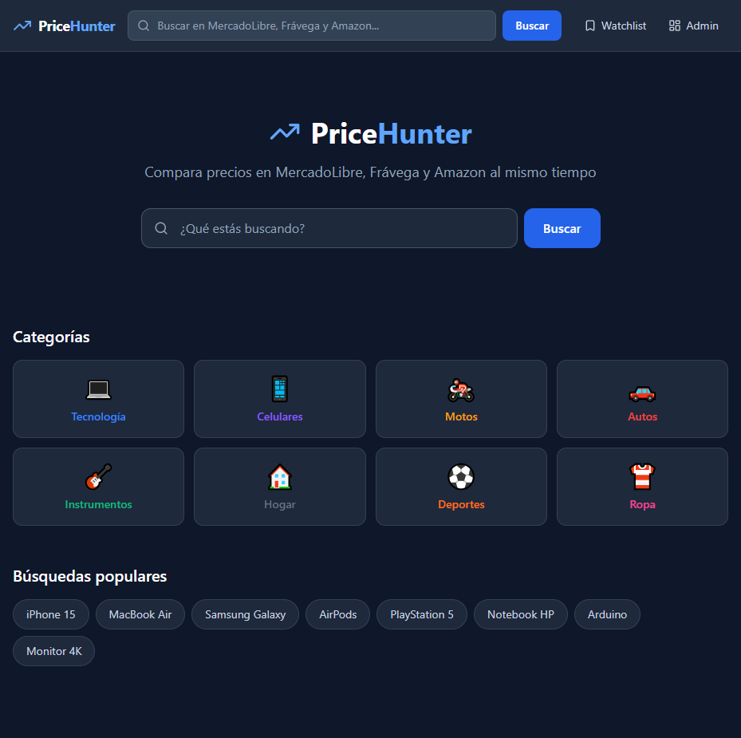
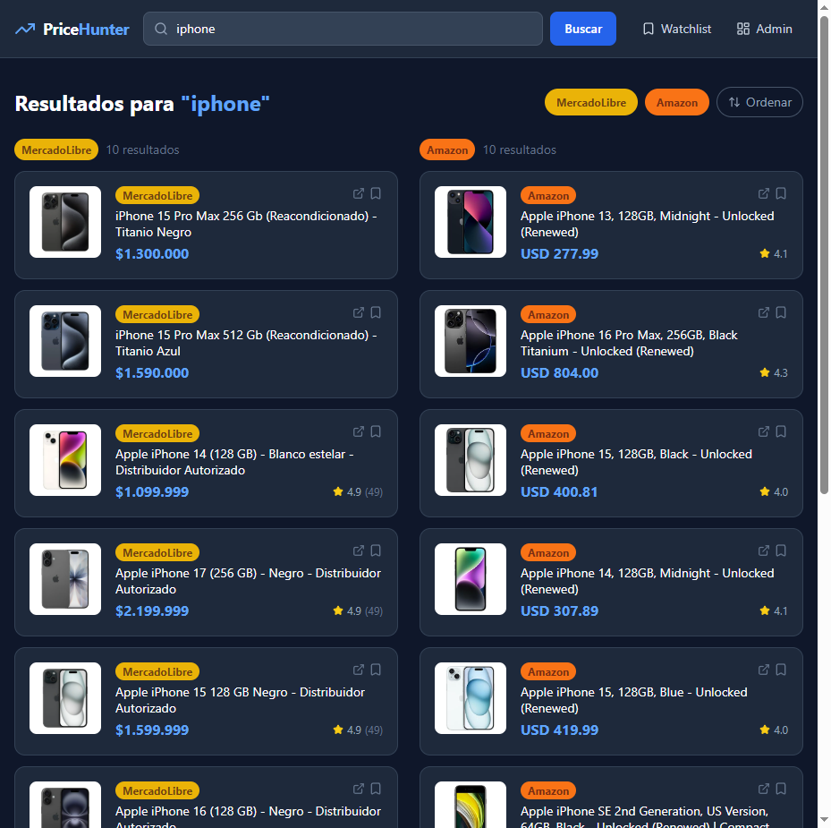
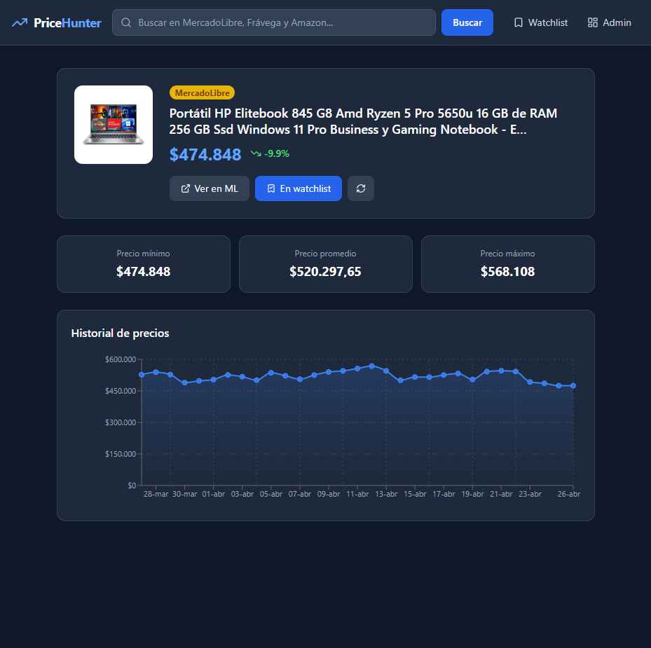
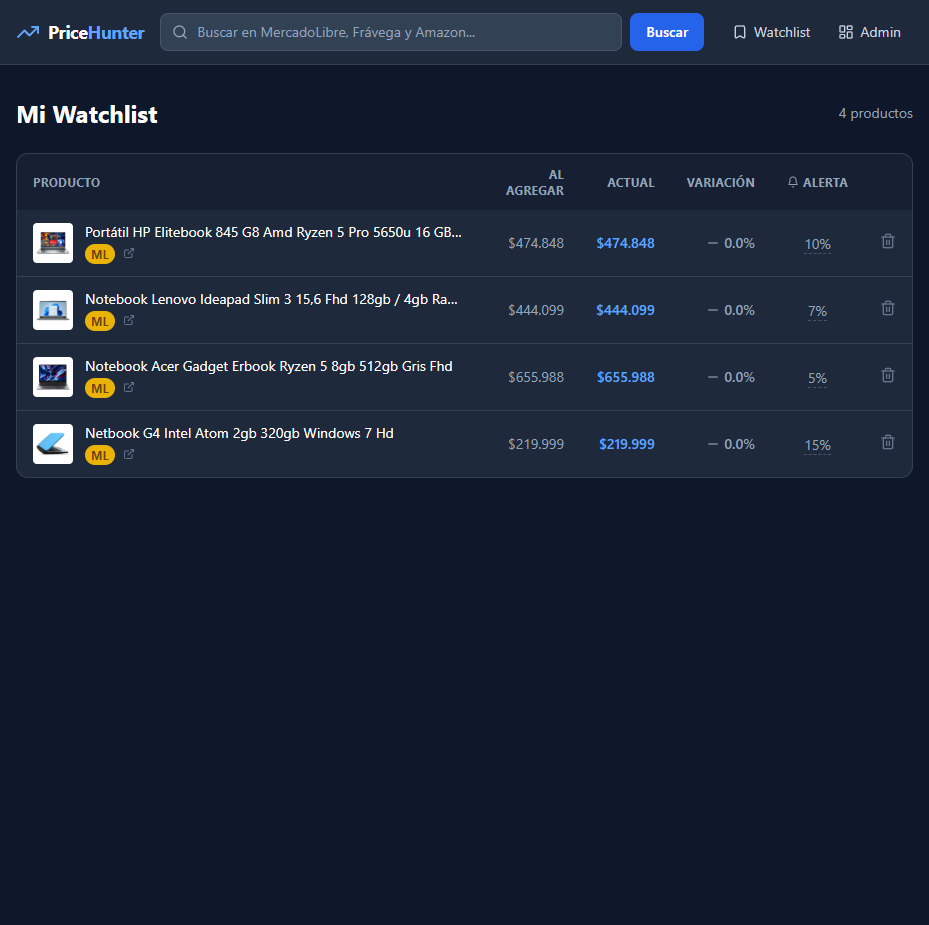

# PriceHunter — Comparador de precios

Comparador y tracker de precios multi-plataforma. Buscá productos en **MercadoLibre AR**, **Frávega** y **Amazon.com** simultáneamente, seguí la evolución histórica de precios y armá tu watchlist personal con alertas configurables.

**Demo en vivo:** [pricehunter-pied.vercel.app](https://pricehunter-pied.vercel.app)  
**API docs:** [pricehunter-api.onrender.com/docs](https://pricehunter-api.onrender.com/docs)

---

## Screenshots

### Home — Categorías y búsquedas populares


### Resultados — ML + Amazon lado a lado con filtros y sort


### Detalle de producto — Historial de precios con gráfico interactivo


### Watchlist — Alertas configurables y semáforo de variación


---

## Features

- **Búsqueda multi-plataforma** — MercadoLibre AR + Amazon.com en paralelo, resultados en grid 2/3 columnas
- **Filtros por fuente** — toggle ML / Frávega / Amazon, oculta columnas vacías automáticamente
- **Sort por precio** — ordena asc/desc en todas las columnas al mismo tiempo
- **Historial de precios** — gráfico de área interactivo (Recharts) con evolución temporal
- **Stats min/max/avg** — estadísticas de precio calculadas sobre el historial
- **Watchlist personal** — guardá productos con alertas de % configurables por ítem (edición inline)
- **Toast notifications** — feedback visual al agregar/quitar productos de watchlist
- **8 categorías** — Tecnología, Celulares, Motos, Autos, Instrumentos, Hogar, Deportes, Ropa
- **Scraping automático** — APScheduler cada 6h para productos en watchlist
- **Panel de administración** — stats globales, tabla paginada y scraping manual

---

## Tech Stack

| Capa | Tecnología |
|------|-----------|
| Backend | FastAPI + Python 3.11 |
| ORM | SQLAlchemy 2.0 async |
| Base de datos | PostgreSQL (Render) |
| Scraping ML | httpx + BeautifulSoup4 (poly-card selectors) |
| Scraping Amazon | curl_cffi (`impersonate="chrome124"` — bypass TLS fingerprint) |
| Scraping Frávega | Playwright + Apollo `__NEXT_DATA__` GraphQL JSON |
| Scheduler | APScheduler (cada 6h) |
| Frontend | React 18 + Vite + TypeScript |
| Estilos | Tailwind CSS v3 |
| Gráficos | Recharts |
| HTTP client | TanStack Query + Axios |
| Deploy API | Render (Oregon) |
| Deploy Frontend | Vercel |

---

## Arquitectura

```
┌────────────────────────────────────────────────────────┐
│  Frontend (Vercel)                                      │
│  React 18 + TypeScript + TanStack Query + Tailwind     │
└───────────────────────┬────────────────────────────────┘
                        │ HTTPS REST
┌───────────────────────▼────────────────────────────────┐
│  Backend API (Render — Oregon)                          │
│  FastAPI + SQLAlchemy async + APScheduler               │
│                                                         │
│  GET /search ──► ml_scraper    (httpx + BS4)           │
│             ──► amazon_scraper (curl_cffi Chrome TLS)  │
│             ──► fravega_scraper (Playwright / proxy)   │
│                                                         │
│  Resultados → upsert DB → response                     │
└───────────────────────┬────────────────────────────────┘
                        │
┌───────────────────────▼────────────────────────────────┐
│  PostgreSQL (Render)                                    │
│  products · price_history · watchlist · categories      │
└────────────────────────────────────────────────────────┘
```

---

## API Endpoints

```
GET  /health
GET  /categories

GET  /search?q=...&cat=slug&limit=10
     → { ml: [...], fravega: [...], amazon: [...] }

GET  /products/{id}
GET  /products/{id}/history
POST /products/{id}/scrape

GET    /watchlist
POST   /watchlist         { product_id, alerta_pct }
PATCH  /watchlist/{id}    { alerta_pct }
DELETE /watchlist/{id}

GET  /admin/products?source=&cat=
GET  /admin/stats
POST /admin/scrape-all
POST /admin/seed-history
```

---

## Setup local

### Backend

```bash
git clone https://github.com/thestrokes1/PriceHunter.git
cd PriceHunter

python -m venv venv
source venv/bin/activate        # Windows: venv\Scripts\activate
pip install -r backend/requirements.txt
playwright install chromium     # solo para scraping Frávega local

# Variables de entorno
cp .env.example .env
# Editar DATABASE_URL con tu PostgreSQL

# Inicializar DB y categorías
PYTHONPATH=. python backend/db/init_db.py

# Correr API
PYTHONPATH=. uvicorn backend.main:app --reload --port 8000
```

### Frontend

```bash
cd frontend
npm install

# Variables de entorno
echo "VITE_API_URL=http://localhost:8000" > .env.local

npm run dev   # → http://localhost:5173
```

---

## Notas de scraping

| Fuente | Método | Estado en prod |
|--------|--------|---------------|
| MercadoLibre | httpx + BS4, selectores `poly-card` | ✅ Funciona |
| Amazon | curl_cffi `chrome124` (bypass TLS fingerprint) | ✅ Funciona |
| Frávega | Playwright + `__NEXT_DATA__` Apollo JSON | ⚠️ Geo-blocked en datacenter |

**Frávega:** Cloudflare bloquea IPs de datacenter (Render Oregon). Funciona perfectamente en local desde IP argentina. Alternativas en evaluación: proxy AR (~$3/mes) o GitHub Actions cron.

---

## Deploy

| Servicio | Plataforma | URL |
|---------|-----------|-----|
| Frontend | Vercel | [pricehunter-pied.vercel.app](https://pricehunter-pied.vercel.app) |
| Backend API | Render (free) | [pricehunter-api.onrender.com](https://pricehunter-api.onrender.com) |
| Base de datos | Render PostgreSQL | Oregon, US |

> El free tier de Render duerme tras 15 min de inactividad — la primera request puede tardar ~15s.

---

Desarrollado por **Cristian** — proyecto portfolio Full Stack Python + React.
